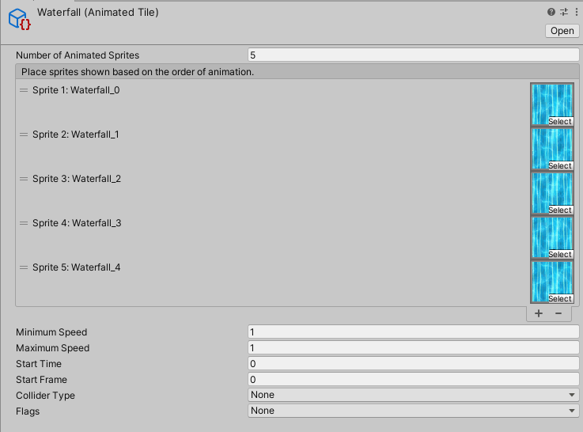

# Animated Tile

__Contribution by:__  MahdiMahzuni

An Animated Tile runs through and displays a list of Sprites in sequence to create a frame-by-frame animation.

 Animated Tile editor window

### Properties

| Property                       | Function                                                     |
| ------------------------------ | ------------------------------------------------------------ |
| __Number of Animated Sprites__ | Number of Animated Sprites in the Animated Tile.             |
| __Sprite list__                | The list displaying the current order of Sprites for this Animated Tile’s animation which plays in sequence. Set a Sprite by selecting the **Select** button at the bottom right of the Sprite preview, then choosing the Sprite from the dialog box. Select and hold the **=** next to each Sprite to reorder their place in the animation sequence. |
| __Minimum Speed__              | The minimum possible speed at which the Animation of the Tile is played. A speed value will be randomly chosen between the minimum and maximum speed. |
| __Maximum Speed__              | The maximum possible speed at which the Animation of the Tile is played. A speed value will be randomly chosen between the minimum and maximum speed. |
| __Start Time__                 | The starting time of this Animated Tile. This allows you to start the Animation from a particular time. |
| __Start Frame__                | The starting frame of this Animated Tile. This allows you to start the Animation from a particular Sprite in the list of Animated Sprites. |
| __Collider Type__              | The [Collider](https://docs.unity3d.com/Manual/Collider2D.html) shape generated by the Tile. |

### Usage

Create the Animated Tile by selecting and ordering the Sprites that makes up its animation sequence in the Animated Tile editor, then paint the Animated Tile with the [Tile Palette tools](https://docs.unity3d.com/Manual/Tilemap-Painting.html).

 Game view, painted with the [Group Brush](GroupBrush.md).