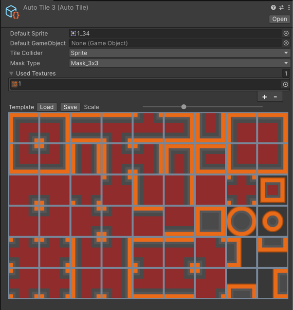

# AutoTile

AutoTiles match themselves based on the mask set on Textures to generate the AutoTile ruleset. Two types of Masks are available for the AutoTile, the 2x2 type for 16 Sprites and the 3x3 type for 47 Sprites set.

### Properties
| Property               | Function                                                                                                                                                      |
|------------------------|---------------------------------------------------------------------------------------------------------------------------------------------------------------|
| __Default Sprite__     | The Sprite set when there are no matches.                                                                                                                     |
| __Default GameObject__ | The GameObject instantiated when set on the Tilemap.                                                                                                          |
| __Tile Collider__      | The Collider Type used for generating colliders.                                                                                                              |
| Mask Type              | Mask Type for setting Rules for the AutoTile. Use 2x2 for a 16 Sprite ruleset and 3x3 for a 47 Sprite ruleset                                                 |
| Used Textures          | Sprites will be used from the selected Textures to make up the ruleset. You will be able to set the appropriate Sprites by painting the masks on the Sprites. |

### Usage

Setup the AutoTile by selecting the appropriate Mask Type and add the required Textures to be used. You can adjust the Scale per Texture to have it sized appropriately in the window.

Each Texture will have its Sprites outlined as a rectangle. Depending on the Mask Type set, the rectangle will be split into portions, either 2x2 or 3x3. Click on each portion to set a mask on that portion. Doing this setups the painting rule for that Sprite. 

Paint masks on each Sprite to setup the ruleset for the AutoTile. If two or more Sprites have the same mask painted on, they will each have a red border to highlight this.

You can save the finished AutoTile ruleset as a TileTemplate by clicking on the Save button. This exports the ruleset for the current Texture. You can load the TileTemplate for another AutoTile using a similar Texture with the same layout without having to setup the masks again. 

Assets used are from https://kenney.nl/assets/top-down-shooter