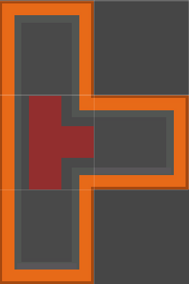
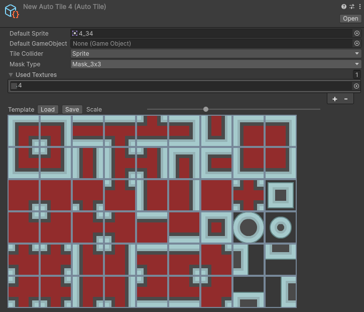

# AutoTile

AutoTiles match themselves based on the mask set on Textures to generate the AutoTile ruleset. Two types of Masks are
available for the AutoTile, the 2x2 type for 16 Sprites and the 3x3 type for 47 Sprites set.

### Properties

| Property               | Function                                                                                                                                                      |
|------------------------|---------------------------------------------------------------------------------------------------------------------------------------------------------------|
| __Default Sprite__     | The Sprite set when there are no matches.                                                                                                                     |
| __Default GameObject__ | The GameObject instantiated when set on the Tilemap.                                                                                                          |
| __Tile Collider__      | The Collider Type used for generating colliders.                                                                                                              |
| Mask Type              | Mask Type for setting Rules for the AutoTile. Use 2x2 for a 16 Sprite ruleset and 3x3 for a 47 Sprite ruleset.                                                |
| Random                 | Randomly picks a Sprite if multiple Sprites share the same mask. Otherwise, uses the first Sprite set with the mask.                                          |
| Used Textures          | Sprites will be used from the selected Textures to make up the ruleset. You will be able to set the appropriate Sprites by painting the masks on the Sprites. |

### Usage

Set up the AutoTile by selecting the appropriate Mask Type and add the required Textures to be used. You can adjust the
Scale per Texture to have it sized appropriately in the window.

Each Texture will have its Sprites outlined as a rectangle. Depending on the Mask Type set, the rectangle will be split
into portions, either 2x2 or 3x3. Click on each portion to set a mask on that portion. Doing these sets up the painting
rule for that Sprite. Paint masks on each Sprite to set up the entire ruleset for the AutoTile.

#### 2x2

Each corner mask must be matched with the same Tiles bordering that corner. For example, if the top right corner is
masked, for this to be matched, there must be the same Tiles to its top, top right and right for it to be matched.

In the below example, the center Tile has the same Tile on all corners except the top left. This matches the mask on the
top right, bottom left and bottom right and will use the corresponding Sprite.

#### 3x3

Each mask on the borders must be matched with the same Tile for the painted Rule to be matched. The center mask
determines if this mask rule is active.

In the below example, the center Tile has the same Tile on the top, right and bottom. This matches the mask with the
borders on the top, right and bottom and will use the corresponding Sprite.

If two or more Sprites have the same mask painted on, they will each have a red border to highlight this. If this error
is not corrected, the first Sprite from the top left will be used when there is a match in the mask.

You can save the finished AutoTile ruleset as a TileTemplate by clicking on the Save button. This exports the ruleset
for the current Texture. You can load the TileTemplate for another AutoTile using a similar Texture with the same layout
without having to set up the masks again. The example below shows an AutoTile with a Texture loaded with an
AutoTileTemplate created from the AutoTile above.

Assets used are from https://kenney.nl/assets/top-down-shooter
