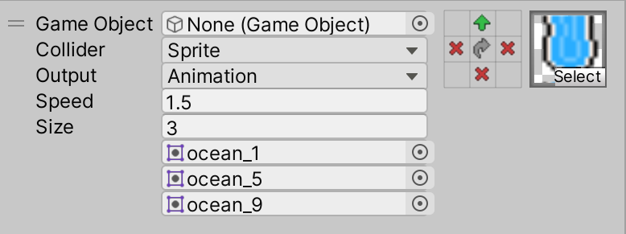
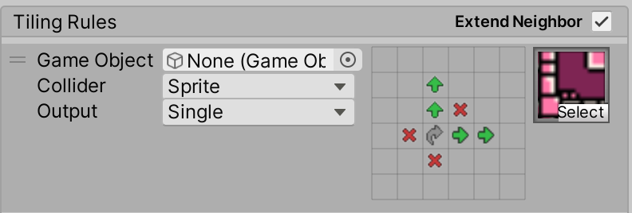

# Rule Tile

__Contributions by:
__ [johnsoncodehk](https://github.com/johnsoncodehk), [DreadBoy](https://github.com/DreadBoy), [AVChemodanov](https://github.com/AVChemodanov), [DoctorShinobi](https://github.com/DoctorShinobi), [n4n0lix](https://github.com/n4n0lix)

This is a generic visual Tile that other Tiles such as
the [Terrain Tiles](TerrainTile.md), [Pipeline Tile](PipelineTile.md), [Random Tile](RandomTile.md)
or [Animated Tiles](AnimatedTile.md) are based on. There are specific types of Rule Tiles for each of
the [Tilemap grid types](https://docs.unity3d.com/Manual/class-Grid.html). The default Rule Tile is for the
default [Rectangle Grid](https://docs.unity3d.com/Manual/Tilemap-CreatingTilemaps.html) type; the Hexagonal Rule Tile is
for the [Hexagonal Grid](https://docs.unity3d.com/Manual/Tilemap-Hexagonal.html) type; and the Isometric Rule Tile is
for the [Isometric Grid](https://docs.unity3d.com/Manual/Tilemap-Isometric.html) types. The different types of Rule
Tiles all possess the same properties.

## Properties

 The Rule Tile editor of a Terrain Tile.

| Property               | Function                                                |
|------------------------|---------------------------------------------------------|
| __Default Sprite__     | The default Sprite set when creating a new Rule.        |
| __Default GameObject__ | The default GameObject set when creating a new Rule.    |
| __Default Collider__   | The default Collider Type set when creating a new Rule. |

### Tiling Rules

 Tiling Rules properties

| Property       | Function                                                                               |
|----------------|----------------------------------------------------------------------------------------|
| __Rule__       | The Rule Type for this Rule.                                                           |
| __GameObject__ | The GameObject for the Tile which fits this Rule.                                      |
| __Collider__   | The Collider Type for the Tile which fits this Rule                                    |
| __Output__     | The Output for the Tile which fits this Rule. Each Output type has its own properties. |

### Output: Fixed

| Property   | Function                                           |
|------------|----------------------------------------------------|
| __Sprite__ | Display this Sprite for Tiles which fit this Rule. |

### Output: Random

| Property    | Function                                                                                                        |
|-------------|-----------------------------------------------------------------------------------------------------------------|
| __Noise__   | The [Perlin noise](https://en.wikipedia.org/wiki/Perlin_noise) factor when placing the Tile.                    |
| __Shuffle__ | The randomized transform given to the Tile when placing it.                                                     |
| __Size__    | The number of Sprites to randomize from.                                                                        |
| __Sprite__  | The Sprite for the Tile which fits this Rule. A random Sprite will be chosen out of this when placing the Tile. |

### Output: Animation

| Property     | Function                                                                                                        |
|--------------|-----------------------------------------------------------------------------------------------------------------|
| __MinSpeed__ | The minimum speed at which the animation is played.                                                             |
| __MaxSpeed__ | The maximum speed at which the animation is played.                                                             |
| __Size__     | The number of Sprites in the animation.                                                                         |
| __Sprite__   | The Sprite for the Tile which fits this Rule. Sprites will be shown in sequence based on the order of the list. |

## Editor Properties

| Property            | Function                                                                        |
|---------------------|---------------------------------------------------------------------------------|
| __Extend Neighbor__ | Enabling this allows you to increase the range of neighbors beyond the 3x3 box. |

## Setting up a Rule Tile

Set up the Rule Tile with the required rules with the __Rule Tile editor__. In the Rule Tile editor, you can change,
add, duplicate or remove Rules in the **Tiling Rules** list. Click on the + or - buttons to add or remove Rules. If you
have a Rule selected, clicking on the + button will allow you to choose between adding a new Rule or duplicating the
selected Rule. The newly created Rule will be placed after the current selected Rule. Select and hold the top left
corner of each row to drag them up or down to change the order of the Rules in the list.

 Rule Tile Editor

When you add a new Rule, the Rule editor displays the following: the list of Rule properties, a 3x3 box that visualizes
the behavior of the set Rules, and a Sprite selector that displays a preview of the selected Sprite.

The 3x3 box represents the neighbors a Tile can have, where the center represents the Tile itself, and the eight
bordering cells are its neighboring Tiles in their relative positions to the Tile. Each of the neighboring cells can be
set with one of three options: **Don't Care**, **This** and **Not This**. These define the behavior of the Rule Tile
towards these Tiles. Edit the 3x3 box to set up the Rule the Tile must match.

| Options        | Rule Tile behavior                                                                                                                                                       |
|----------------|--------------------------------------------------------------------------------------------------------------------------------------------------------------------------|
| __Don't Care__ | The Rule Tile ignores the contents in this cell.                                                                                                                         |
| __This__       | The Rule Tile checks if the contents of this cell is an instance of this Rule Tile. If it is an instance, the rule passes. If it is not an instance, the rule fails.     |
| __Not This__   | The Rule Tile checks if the contents of this cell is not an instance of this Rule Tile. If it is not an instance, the rule passes. If it is an instance, the rule fails. |

If all of the neighbors of the Rule Tile match the options set for their respective directions, then the Rule is
considered matched and the rest of the Rule properties are applied.

When the Rule is set to Fixed, the Rule will only match exactly the conditions set for its neighbors. The example below
will only match if there are the same Rule Tiles to the left and right of it.

When the Rule is set to ‘Rotated’, the 3x3 box will be rotated 90 degrees each time the Rule fails to match and it will
try to match again with this rotated 3x3 box. If the Rule now matches, the contents of this Rule will be applied as well
as the rotation required to match the Rule. Use this if you want the Rule to match for the four 90 degree rotations if
rotation is possible.

When the Rule is set to Mirror X, Mirror Y or Mirror XY, the 3x3 box will be mirrored in that axis each time the Rule
fails to match and it will try to match again with this mirrored 3x3 box. If the Rule now matches, the contents of this
Rule will be applied as well as the mirroring required to match the Rule. Use this if you want the Rule to match for the
mirrored locations if mirroring is possible.

If you want the Rule Tile to have a Random output, you can set the Output to Random. This will allow you to specify a
number of input Sprites to randomize from. The rotation of the Sprites can be randomized as well by changing the _
_Shuffle__ property.

If you want the Rule Tile to output a Sprite Animation, you can set the Output to Animation. This will allow you to
specify a number of Sprites to animate sequentially. The speed of the Animation can be randomized as well by changing
the __Speed__ property.

When <b>Extend Neighbors</b> is enabled, the 3x3 box can be extended to allow for more specific neighbor matching. The
Transform rule matching (eg. Rotated, Mirror) will apply for the extended neighbors set.

Paint with the Rule Tile in the same way as other Tiles by using the Tile Palette tools.

For optimization, please set the most common Rule at the top of the list of Rules and follow with next most common Rule
and so on. When matching Rules during the placement of the Tile, the Rule Tile algorithm will check the first Rule
first, before proceeding with the next Rules.
