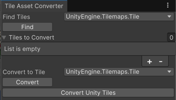

# Tile Asset Converter

The Tile Asset Converter allows you to convert Tile assets of one type to another type. The Tile asset will only retain serialized data between types if they share the exact same name, eg. "m_Sprite" in the first type and "m_Sprite in the second type". References to the Tile asset will remain the same. For example, if a Tilemap refers to a particular Tile Asset at position (0, 0, 0), it will still refer to that Tile asset even if the Tile Asset has its type changed by the Tile Asset Converter.

To access the Tile Asset Converter, from the menu bar, select Window/2D/Tile Asset Converter and the Tile Asset Converter window will open.

## Finding Tiles in the Project by Type

To find Tile assets of a Type, select the name of the Type you wish to find in the "Find Tiles" dropdown. Once selected, click on the "Find" button to find the Tile assets. Any found Tile assets will be populated in the "Tiles to Convert" list below. You may undo the results of finding the Tile assets

## Converting Tiles to another Type

To convert Tile assets to another type, first populate the "Tiles to Convert" list. You may populate the list by finding Tiles in the project by type, as listed above, or manually adding the Tile assets to the list. Next, select the Type to convert the Tile assets to in the "Convert To Tile" dropdown. Once selected, click on the "Convert" button to convert the Tile assets. You will need to save the project to finalize the conversion of the Tile assets in your project. 

## Converting Unity Tiles

This button automatically converts Unity Tile types to their corresponding Unity Entity Tile types.

The following types will be converted:
- Tile to EntityIdTile
- AnimatedTile to AnimatedEntityIdTile
- RuleTile to RuleEntityIdTile
- AutoTile to AutoEntityIdTile

Click on the "Convert Unity Tiles" button to convert these Tile assets. The Unity Editor will automatically find the Tile assets, convert them and save the project.
