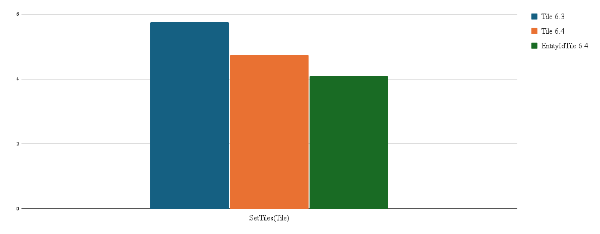
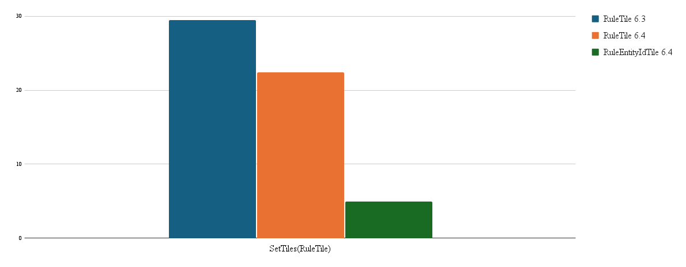

# Scriptable Tiles

You can script Tiles to adapt to different criteria and conditions, such as its position on the Tilemap. It then
displays the Sprite which meets its scripted requirements. This allows you to create different Tiles that can help you
save time and be more efficient when creating Tilemaps. Refer to
the [Scriptable Tiles](https://docs.unity3d.com/Manual/Tilemap-ScriptableTiles.html) page for more information.

The following **Scriptable Tiles** are included in this package, with examples of how they are implemented. You can use
these Tiles as the base for your own custom Tiles as well.

- [Animated Tile](AnimatedTile.md)
- [Auto Tile](AutoTile.md)
- [Rule Tile](RuleTile.md)
- [Rule Override Tile](RuleOverrideTile.md)

# Scriptable Entity Id Tiles

To improve performance of setting scriptables Tiles onto the Tilemap, you can choose to create your custom Tile by deriving from EntityIdTileBase and implementing the required functions. By doing so, the Tilemap is able to make use of Unity Jobs and Burst to retrieve data from your custom Tile and improve performance. The Tilemap can utilize Unity Jobs and Burst only if __all__ Tiles placed are valid Tiles derived from EntityIdTileBase. Using a mixture of Scriptable Tiles and Scriptable Entity Id Tiles will cause the Scriptable Entity Id Tiles to fallback to their Scriptable Tile methods.

The following charts show a performance comparison between the original scriptable Tiles and the Scriptable Entity Id Tiles from Unity 6.3 and 6.4 with the Windows Player:

__Tile__:

__Rule Tile__:

__Auto Tile__:

Refer to the [Custom Entity Id Tiles](CustomEntityIdTiles.md) page for more information. 
